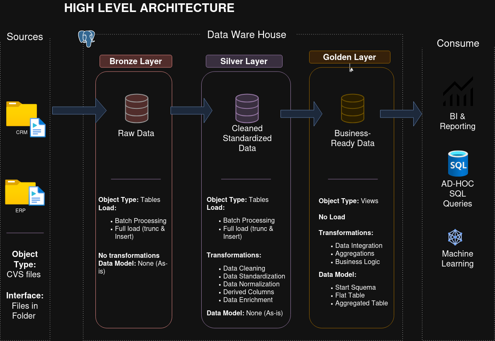

# Data Warehouse and Analytics Project
Construyendo un Data Warehouse Moderno Con Pgadmin4 , Incluyendo Procesos de ETL, modelado de datos y análisis.
Este proyecto demuestra una solución integral de almacenamiento de datosy análisis, desde la construcción de un Data WareHouse hasta la generación de información accionable.

## 🏗️ Arquitectura de datos

La arquitectura de datos de este proyecto sigue las capas **Bronze**, **Silver** y **Gold** de la arquitectura Medallion:


1. **Capa de bronce (Bronze Layer)**: Almacena datos sin procesar, tal como provienen de los sistemas de origen. Los datos se ingieren desde archivos CSV a una base de datos Postgresql.
2. **Capa de plata (Silver Layer)**: Esta capa incluye procesos de limpieza, estandarización y normalización de datos para prepararlos para el análisis.
3. **Capa de oro (Gold Layer)**: Contiene datos listos para el negocio, modelados en un esquema de estrella necesario para la generación de informes y el análisis.

## 📖 Descripción general del proyecto

Este proyecto comprende:

1. **Arquitectura de datos**: Diseño de un almacén de datos moderno (*Data Warehouse*) utilizando la arquitectura Medallion con capas **Bronze**, **Silver** y **Gold**.
2. **Pipelines ETL**: Extracción, transformación y carga de datos desde sistemas de origen hacia el almacén de datos.
3. **Modelado de datos**: Desarrollo de tablas de hechos y dimensiones optimizadas para consultas analíticas.
4. **Análisis y generación de informes**: Creación de informes y paneles basados ​​en SQL para obtener información accionable.


### Construcción del DataWareHouse (Data Engineering)

#### Objetivo
Desarrollar un DataWareHouse moderno utilizando Pgadmin4 para consolidar información de ventas, facilitando la generación de informes analíticos y la toma de decisiones fundamentada.

#### Especificaciones
- **Fuentes de datos**: Importar datos de dos sistemas de origen (ERP y CRM) suministrados en formato CSV.
- **Calidad de los datos**: Depurar y resolver problemas de calidad de los datos antes del análisis.
- **Integración**: Combinar ambas fuentes en un modelo de datos único e intuitivo, diseñado para consultas analíticas.
- **Alcance**: Centrarse únicamente en el conjunto de datos más reciente; no se requiere la historización de los datos.
- **Documentación**: Proporcionar documentación clara del modelo de datos para apoyar tanto a los interesados ​​del negocio como a los equipos de análisis.

---

### BI: Análisis e informes (Data Analysis)

#### Objetivo
Desarrollar análisis basados ​​en SQL para obtener información detallada sobre:
- **Comportamiento del cliente**
- **Rendimiento del producto**
- **Tendencias de ventas**

Esta información proporciona a los interesados ​​métricas clave del negocio, facilitando la toma de decisiones estratégicas.

## 📂 Estructura del repositorio 
```
sql-data-warehouse-project/
│
├── datasets/                           # Conjuntos de datos sin procesar utilizados para el proyecto (datos de ERP y CRM)
│
├── docs/                               # Documentación del proyecto y detalles de la arquitectura
│   ├── arquitectura_de_datos.drawio    # Archivo Draw.io que muestra la arquitectura del proyecto.
│   ├── data_catalog.md                 # Catálogo de los conjuntos de datos, incluidas las descripciones de los campos y los metadatos.
│   ├── flujo_de_datos.drawio           # Archivo Draw.io para el diagrama de flujo de datos
│   ├── modelo_de_datos.drawio          # Archivo Draw.io para modelos de datos (start schema)
│
├── scripts/                            # Scripts SQL para ETL y transformaciones
│   ├── bronze/                         # Scripts para extraer y cargar datos sin procesar
│   ├── silver/                         # Scripts para limpiar y transformar datos
│   ├── gold/                           # Scripts para crear modelos analíticos
│
├── tests/                              # Scripts de prueba y archivos de calidad
│
├── README.md                           # Descripción general del proyecto e instrucciones

## 🌟 Acerca de mi

Hola, soy **Liz Garcete**, estudiante de Análisis de Sistemas Informáticos. Como parte de mi formación, he decidido desarrollar la construcción de un Data Warehouse como mi primer proyecto orientado a un entorno más cercano al ámbito laboral.

Este proyecto representa una oportunidad para poner en práctica los conocimientos adquiridos durante mi formación, fortalecer mis habilidades en el análisis y gestión de datos, y acercarme a la forma en que se desarrollan soluciones tecnológicas en un contexto profesional.
